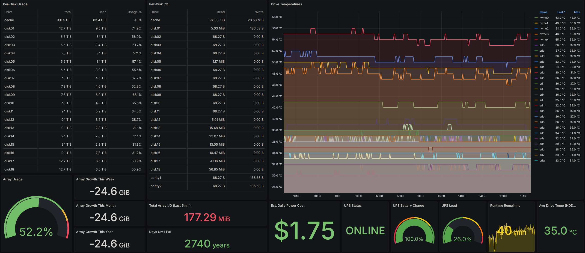

# Unraid Array Monitoring Dashboard

**Comprehensive monitoring for Unraid storage arrays with 15 panels covering storage, health, and power metrics**



---

## Features

### Storage Monitoring
- **Array Usage Gauge** - Current array utilization percentage
- **Array Growth Tracking** - Week/month/year growth calculations
- **Days Until Full** - Predictive analytics based on growth rate
- **Per-Disk Usage Table** - Individual disk usage for all array members
- **Per-Disk I/O Table** - Read/write metrics per disk

### Health Monitoring
- **Drive Temperatures** - Time-series graph of all drive temps
- **Average Drive Temperature** - Quick health indicator
- **Total Array I/O** - Current I/O load (last 5min)

### Power & UPS
- **UPS Status** - Online/battery status
- **UPS Battery Charge** - Battery level gauge
- **UPS Load** - Current load percentage
- **Runtime Remaining** - Time left on battery
- **Estimated Daily Power Cost** - Power consumption tracking

---

## Requirements

### Software Stack
- **Unraid 6.9+** (tested on 6.12+)
- **InfluxDB v2** - Time-series database
- **Grafana** - Dashboard platform
- **Telegraf** - Metrics collector

### Hardware Requirements
- Unraid server with array
- Optional: UPS with apcupsd for power monitoring
- Sufficient storage for metrics (InfluxDB requires ~100MB-1GB for long-term storage)

---

## Installation Guide

### Part 1: Deploy InfluxDB (via Unraid Community Applications)

**Option A: Deploy on Unraid**
1. Open Unraid web UI → **Apps** tab
2. Search for **"influxdb"**
3. Install **influxdb** (official image)
4. Configure:
   - Container name: `influxdb`
   - Port: `8086` (or custom)
   - Volume: `/mnt/user/appdata/influxdb:/var/lib/influxdb2`
5. Start container
6. Access web UI: `http://YOUR-UNRAID-IP:8086`
7. Complete setup wizard:
   - Username: (your choice)
   - Password: (secure password)
   - Organization: `homelab`
   - Bucket: `unraid`
8. **Save the API token** - you'll need it for Telegraf

**Option B: Deploy on separate server (TrueNAS, Linux, etc.)**
- Follow same steps on target platform
- Note the IP address for Telegraf config

---

### Part 2: Deploy Grafana (via Unraid Community Applications)

1. Open Unraid web UI → **Apps** tab
2. Search for **"grafana"**
3. Install **grafana** (official image)
4. Configure:
   - Container name: `grafana`
   - Port: `3000` (or custom)
   - Volume: `/mnt/user/appdata/grafana:/var/lib/grafana`
5. Start container
6. Access web UI: `http://YOUR-UNRAID-IP:3000`
7. Default login:
   - Username: `admin`
   - Password: `admin` (change on first login)

---

### Part 3: Deploy Telegraf on Unraid

**1. Install Telegraf via Community Applications**

1. Open Unraid web UI → **Apps** tab
2. Search for **"telegraf"**
3. Install **golift/telegraf** (recommended for Unraid)
   - Repository: `golift/telegraf:latest`
4. **STOP** - Don't start yet, we need to configure first

**2. Create Telegraf Configuration**

1. Create config directory:
   ```bash
   mkdir -p /mnt/user/appdata/telegraf
   ```

2. Copy the `telegraf.conf` from this repository to:
   ```
   /mnt/user/appdata/telegraf/telegraf.conf
   ```

3. Edit the config file and update:
   - Line 29: Replace `YOUR_INFLUXDB_URL` with your InfluxDB URL
     - If InfluxDB is on Unraid: `http://UNRAID-IP:8086`
     - If on separate server: `http://SERVER-IP:8086`
   - Line 32: Replace `YOUR_INFLUXDB_TOKEN` with your InfluxDB API token
   - Line 38: Verify bucket name matches (`unraid`)

**3. Configure Telegraf Container**

**Required Docker settings:**

| Setting | Value | Purpose |
|---------|-------|---------|
| **Repository** | `golift/telegraf:latest` | Telegraf image |
| **Config Volume** | `/mnt/user/appdata/telegraf/telegraf.conf:/etc/telegraf/telegraf.conf:ro` | Mount config file |
| **Host Filesystem** | `/:/hostfs:ro` | Access host disks |
| **Proc** | `/proc:/host/proc:ro` | Process metrics |
| **Sys** | `/sys:/host/sys:ro` | System metrics |
| **Docker Socket** | `/var/run/docker.sock:/var/run/docker.sock:ro` | Docker metrics (optional) |
| **Devices** | `/dev:/dev:ro` | SMART data access |

**Required Environment Variables:**

| Variable | Value |
|----------|-------|
| `HOST_PROC` | `/host/proc` |
| `HOST_SYS` | `/host/sys` |
| `HOST_MOUNT_PREFIX` | `/hostfs` |

**Required Permissions:**
- ✅ **Privileged Mode:** `ON` (required for SMART data)
- ✅ **Network Mode:** `host` (recommended for accurate metrics)

**4. Start Telegraf**

1. Save container configuration
2. Start Telegraf container
3. Check logs for errors:
   ```bash
   docker logs telegraf
   ```
4. You should see: `Started the agent` with no errors

**5. Verify Metrics**

1. Open InfluxDB web UI
2. Go to **Data Explorer**
3. Select bucket: `unraid`
4. Look for measurements: `cpu`, `mem`, `disk`, `diskio`, `smart_device`, etc.
5. If you see data → Success! ✅

---

### Part 4: Import Dashboard to Grafana

**1. Add InfluxDB Data Source**

1. Open Grafana → **Configuration** → **Data Sources**
2. Click **Add data source**
3. Select **InfluxDB**
4. Configure:
   - Name: `influxdb` or `InfluxDB-Unraid`
   - Query Language: **Flux**
   - URL: `http://YOUR-INFLUXDB-IP:8086`
   - Auth: OFF (if on same network)
   - Organization: `homelab`
   - Token: (your InfluxDB API token)
   - Default Bucket: `unraid`
5. Click **Save & Test**
6. You should see: "Data source is working" ✅

**2. Import Dashboard**

1. Download `grafana-unraid-dashboard.json` from this repository
2. In Grafana, go to **Dashboards** → **Import**
3. Click **Upload JSON file**
4. Select `grafana-unraid-dashboard.json`
5. Configure:
   - Name: `Unraid Array Monitoring` (or customize)
   - Folder: (your choice)
   - InfluxDB data source: Select the one you just created
6. Click **Import**

**3. Verify Dashboard**

- All panels should show data
- If panels show "No data":
  - Check InfluxDB connection
  - Verify Telegraf is running and collecting metrics
  - Check bucket name matches in queries

---

## Configuration Notes

### Customization Options

**Adjust for your array:**
- Dashboard shows disk1-disk20 by default
- If you have fewer disks, panels will show "No data" for non-existent disks (this is normal)
- Temperature thresholds: Edit panels to set your preferred limits

**UPS Monitoring:**
- Requires `apcupsd` running on Unraid
- If you don't have UPS, those panels will show "No data" (safe to ignore or delete)
- Install apcupsd via Unraid Community Applications if needed

**Power Cost Calculation:**
- Edit the "Est. Daily Power Cost" panel
- Update the electricity rate in the query (default: $0.10/kWh)

### Telegraf Collection Intervals

- Default: 60 seconds (good balance)
- For faster updates: Change `interval = "60s"` to `"30s"` in telegraf.conf
- For less frequent: Change to `"120s"` or `"300s"`
- Restart Telegraf after changes

### Disk Paths

If your disk paths differ from `/mnt/disk1`, `/mnt/disk2`, etc., update the Telegraf config:
```toml
mount_points = [
  "/mnt/user",
  "/mnt/cache",
  "/your/custom/path1",
  "/your/custom/path2",
]
```

---

## Troubleshooting

### Telegraf Not Collecting Data

**Check 1: Container logs**
```bash
docker logs telegraf
```
Look for connection errors or permission issues.

**Check 2: Privileged mode**
- SMART data requires privileged mode
- Check container settings: "Privileged" must be ON

**Check 3: Volume mounts**
- Verify all volume mounts are correct
- Especially `/dev:/dev:ro` for SMART data

**Check 4: InfluxDB connection**
- Verify URL is reachable from Telegraf container
- Test: `docker exec telegraf ping YOUR-INFLUXDB-IP`
- Check token is correct

### Panels Show "No Data"

**Check 1: Data source connection**
- Grafana → Data Sources → Test connection
- Should show "Data source is working"

**Check 2: Bucket name**
- Verify InfluxDB bucket exists
- Check bucket name in queries matches your setup

**Check 3: Measurement names**
- Open InfluxDB Data Explorer
- Verify measurements exist: `cpu`, `mem`, `disk`, etc.

**Check 4: Time range**
- Ensure time range selector (top right) is appropriate
- Try "Last 6 hours" first

### SMART Data Missing

**Check 1: smartctl installed**
```bash
docker exec telegraf smartctl --version
```

**Check 2: Device access**
```bash
docker exec telegraf ls -la /dev/sd*
```

**Check 3: Privileged mode**
- SMART requires privileged container
- Check container is running with `--privileged`

### UPS Panels Show "No Data"

**Check 1: apcupsd running**
```bash
ps aux | grep apcupsd
```

**Check 2: apcupsd listening**
```bash
netstat -ln | grep 3551
```

**Check 3: Telegraf can connect**
```bash
docker exec telegraf nc -zv 127.0.0.1 3551
```

---

## Dashboard Panels Reference

| Panel | Query Measurement | Purpose |
|-------|------------------|---------|
| Array Usage | `disk` (path=/mnt/user) | Overall array capacity |
| Array Growth | `disk` (path=/mnt/user) | Growth calculations |
| Days Until Full | `disk` (path=/mnt/user) | Predictive analysis |
| Per-Disk Usage | `disk` (path=~disk[0-9]+) | Individual disk usage |
| Per-Disk I/O | `diskio` | Disk I/O statistics |
| Drive Temperatures | `smart_device` (temp_c) | Temperature monitoring |
| Avg Drive Temp | `smart_device` (temp_c) | Temperature summary |
| Total Array I/O | `diskio` | Current I/O load |
| UPS Status | `apcupsd` (status) | UPS online/battery |
| UPS Battery | `apcupsd` (battery_charge_percent) | Battery level |
| UPS Load | `apcupsd` (load_percent) | Current load |
| Runtime Remaining | `apcupsd` (time_left_ns) | Battery time left |
| Power Cost | Custom calculation | Power usage cost |

---

## Contributing

**Found a bug or have improvements?**
- Open an issue in the main repository
- Submit a pull request with fixes
- Share your customizations

---

## Credits

**Created by:** TadMSTR  
**Tested on:** Unraid 6.12.6  
**Dashboard Version:** 1.0  
**Last Updated:** 2026-02-15

---

## License

MIT License - Free to use and modify

---

## Screenshots

### Full Dashboard (6 Hour View)


*Dashboard showing 6 hours of metrics including array usage, per-disk statistics, drive temperatures, and UPS monitoring*

---

*Dashboard JSON and configuration files are located in this directory*
